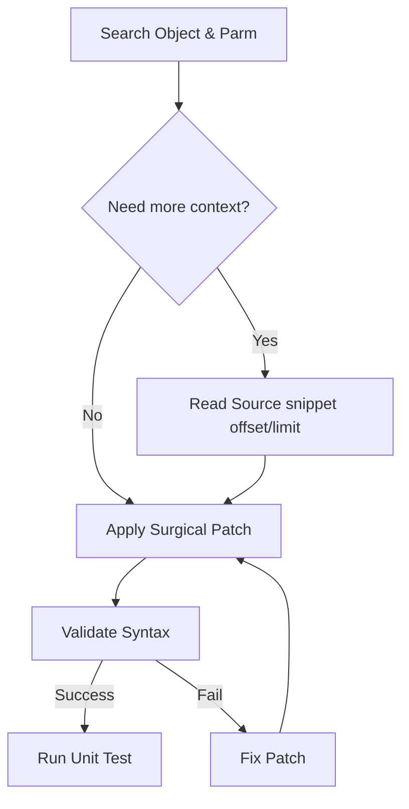

# 🎓 GeneXus MCP Mastery (Elite Edition v19.0)

This skill provides the definitive guide for using the **Genexus18MCP** server at its peak performance. It focuses on surgical precision, token efficiency, and instant KB interaction.

## 🚀 Elite Tool Selection

| Tool                   | Best Use Case                                                            | Performance                               |
| :--------------------- | :----------------------------------------------------------------------- | :---------------------------------------- |
| `genexus_patch`        | **PRIMARY EDIT TOOL.** Surgical line-by-line replacement using context.  | Instant (Background Flush).               |
| `genexus_search`       | Find objects AND their signatures (`parm`). Supports `usedby:TableName`. | Zero-Latency (Super Cache).               |
| `genexus_read_source`  | Token-efficient reading via `offset` and `limit`. Includes variable meta.| Optimized (Smart Read).                   |
| `genexus_validate`     | **Pre-save check.** Runs native SDK syntax diagnostics.                  | SDK Native.                               |
| `genexus_test`         | Executes GXtest Unit Tests and captures real results.                    | MSBuild Integration.                      |

## 🏎️ Performance Protocols

1.  **Background Flushing**: Changes to the cache are saved asynchronously. You do not need to wait for disk I/O after a `patch` or `write`.
2.  **Super Cache**: The search index contains `parm` rules and code snippets. Always check search results before calling `read_source`.
3.  **Smart Read**: Reading source code automatically injects definitions for local variables used in that snippet.

## 💉 Surgical Editing (`genexus_patch`)

Always prefer `genexus_patch` over `genexus_write_object` for existing code.
- **Precision**: Provide at least 2-3 lines of `context` (old_string) to ensure unique matching.
- **Safety**: The tool will fail if the context is ambiguous, preventing accidental double-edits.
- **Efficiency**: Saves thousands of tokens by not sending the full object body back and forth.

## 🔄 The Elite Workflow

## 🧠 Intelligence: Smart Variable Injection

The MCP automatically handles variable definitions in `genexus_write_object` and `genexus_patch`. 
- If you use `&CustomerId` and `CustomerId` is an attribute, the MCP copies its definition.
- **Rule**: Do not waste time manually adding variables to the `Variables` part if they follow attribute naming or common patterns (Date, Boolean, Numeric).
