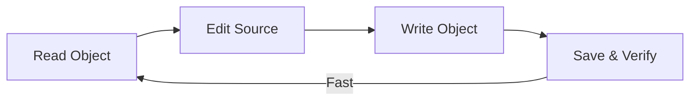
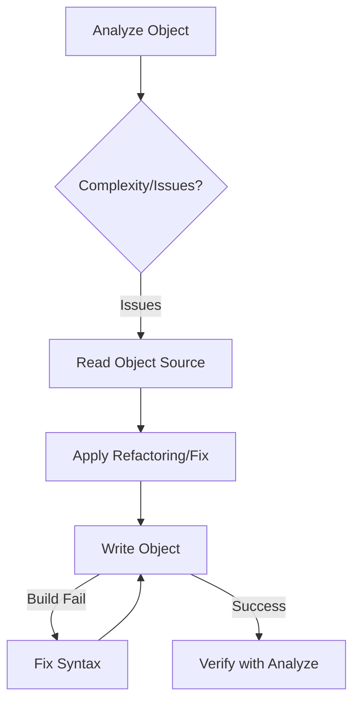

# 🎓 GeneXus MCP Mastery

This skill provides the definitive guide for using the **Genexus18MCP** server to interact with GeneXus 18 Knowledge Bases. It focuses on maximizing performance (via caching) and ensuring code quality (via the Native Linter).

## 🛠️ The Native SDK Power Tools

| Tool                   | Best Use Case                                                            | Performance                               |
| :--------------------- | :----------------------------------------------------------------------- | :---------------------------------------- |
| `genexus_analyze`      | **Always run first.** Checks complexity and lints for `COMMIT` in loops. | Instant (SDK Meta Analysis).              |
| `genexus_read_object`  | Retrieval of Source/Rules. Full XML + GUID dump.                         | Instant (<100ms) via `KbService`.         |
| `genexus_write_object` | Surgical edits to Source, Rules, or Events.                              | Near-Instant. Direct `obj.Save()`.        |
| `genexus_batch`        | Large-scale refactors. Atomic commit.                                    | Optimized multi-save.                     |

## 🚀 The SDK Bootstrap Protocol

The server uses a specialized **Standalone Bootstrapping** sequence for GeneXus 18:

1.  **Bitness**: Worker must be **x86** (32-bit) to match the GeneXus DLLs.
2.  **Sequence**: `Connector.Initialize()` -> `Connector.StartBL()`.
3.  **Discovery**: An `AssemblyResolve` handler dynamically finds DLLs in `%GX_PATH%` and `%GX_PATH%\Packages`.
4.  **Logging**: Enterprise Library 3.1 configuration in `App.config` is mandatory to prevent internal SDK crashes from masking errors.

## 🔄 Instant Development Cycle

With the Native SDK, the development loop is no longer blocked by MSBuild:

- **Persistence**: `KbService` keeps the KB open. First call takes 5-10s; subsequent calls are instant.
- **Cache Invalidation**: `write_object` automatically invalidates the internal cache for that object.

## 🧠 Intelligence: The Native Linter

The `genexus_analyze` tool performs static analysis. Pay attention to the `insights` array:

1.  **CRITICAL**: `COMMIT` inside `For Each`.
    - _Fix_: Move the commit outside the loop to respect the LUW (Logical Unit of Work).
2.  **WARNING**: Dynamic `Call(&Var)`.
    - _Fix_: Use hardcoded object names to preserve the dependency tree.
3.  **INFO**: `New` without `When Duplicate`.
    - _Fix_: Always handle collision cases for data integrity.

## 🔄 Standard Workflow (The Loop)

## 🛡️ Resilience: Handling "Hangs"

The Gateway uses a **Circuit Breaker**.

- If the Worker process crashes, the Gateway restarts it automatically.
- **Agent Action**: If you see a timeout, simply retry the command once. The Gateway will have swapped the binary or restarted the pipe.

## 📝 GeneXus Coding Best Practices (for AI)

- **Variable Declarations**: GeneXus variables are often inferred, but you should declare them in the `Variables` part if adding new logic.
- **The Parm Rule**: Always check the `Rules` part before modifying parameters.
- **LUW Management**: Do not add manual `Commit` commands unless you are sure you are at the end of a logical transaction.
