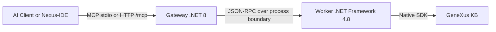

# GeneXus 18 MCP Server (Genexus18MCP)

A Model Context Protocol (MCP) server for GeneXus 18 with a .NET 8 gateway, a .NET Framework 4.8 worker, and a VS Code extension that operates directly against the MCP surface.

## Key Features

- Native GeneXus SDK integration through the worker process.
- MCP over stdio and HTTP at `/mcp`.
- MCP-first Nexus-IDE runtime for discovery, VFS, providers, commands, and shadow sync.
- Dynamic tool registry in `src/GxMcp.Gateway/tool_definitions.json`.
- HTTP session handling with protocol-version negotiation and SSE support.

## Nexus-IDE

The repository includes `src/nexus-ide`, a lightweight VS Code extension for GeneXus work:

- Virtual file system using the `genexus://` scheme
- KB explorer
- Multi-part editing for source, rules, events, and variables
- MCP discovery commands for tools, resources, and prompts

The extension uses `/mcp` directly. The legacy `/api/command` path has been removed from the gateway.

## Installation

### Fast path

1. Clone the repository.
2. Run `.\install.ps1` in PowerShell.
3. If your `config.json` values are invalid, the installer will prompt for the GeneXus installation path and the KB path.
4. Restart Claude/Codex if they were already open.
5. Open your KB folder in VS Code.

Notes:

- The installer updates `config.json`, builds the gateway/worker, packages `src/nexus-ide/nexus-ide.vsix`, configures Claude Desktop, and configures Codex.
- Automatic extension installation works with the editor CLIs found in `PATH` among `code`, `code-insiders`, `cursor`, `codium`, and `antigravity`. If none are present, install the generated `.vsix` manually.
- The desktop launcher at `publish/start_mcp.bat` exports `GX_CONFIG_PATH` and reuses the current repository gateway build when available, so local MCP clients and the extension share the repository-root `config.json`.
- `build.ps1` now refreshes both the publish/runtime artifacts and the debug-consumed artifacts in one pass, so `F5` and external MCP clients stop drifting onto different gateway/worker builds.

### Development build

```powershell
.\build.ps1
```

## Configuration

Edit `config.json`:

```json
{
  "Server": {
    "HttpPort": 5000,
    "BindAddress": "127.0.0.1",
    "AllowedOrigins": [],
    "SessionIdleTimeoutMinutes": 10
  },
  "GeneXus": {
    "InstallationPath": "C:\\Program Files (x86)\\GeneXus\\GeneXus18",
    "WorkerExecutable": "worker\\GxMcp.Worker.exe"
  },
  "Environment": {
    "KBPath": "C:\\KBs\\YourKB"
  }
}
```

## Correct MCP Usage

Official transports:

- stdio MCP for desktop clients
- HTTP MCP at `http://127.0.0.1:5000/mcp`

HTTP MCP rules:

1. Send `initialize` first.
2. Include `MCP-Protocol-Version: 2025-06-18`.
3. Persist and reuse the returned `MCP-Session-Id`.
4. Use discovery methods before hardcoding assumptions: `tools/list`, `resources/list`, `resources/templates/list`, `prompts/list`.
5. Execute work with `tools/call`, `resources/read`, and `prompts/get`.
6. Use `GET /mcp` for SSE notifications when needed.
7. Use `DELETE /mcp` to close the session.

The gateway is MCP-only on HTTP. Use `/mcp`.

## Tool Surface

See `GEMINI.md` for guidance. The main MCP tools are:

- `genexus_query`
  - supports optional `typeFilter` and `domainFilter` for server-side narrowing before ranking/truncation
  - `genexus_read`
  - `genexus_batch_read`
- `genexus_edit`
- `genexus_batch_edit`
- `genexus_inspect`
- `genexus_analyze`
- `genexus_inject_context`
- `genexus_lifecycle`
- `genexus_get_sql`
- `genexus_test`
- `genexus_create_object`
- `genexus_refactor`
- `genexus_add_variable`
- `genexus_format`
- `genexus_properties`
- `genexus_history`
- `genexus_structure`
- `genexus_doc`

## Architecture



## Current State

- The extension is MCP-first.
- The gateway and worker remain the production architecture.
- The HTTP transport is MCP-only at `/mcp`.
