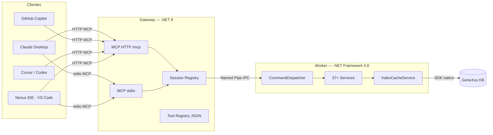

# GeneXus 18 MCP Server

> **Fork de [lennix1337/Genexus18MCP](https://github.com/lennix1337/Genexus18MCP)** · Mantido e expandido com melhorias de estabilidade, tooling de IA e integração avançada com VS Code.

Um servidor **Model Context Protocol (MCP)** para GeneXus 18, com gateway .NET 8, worker .NET Framework 4.8 e uma extensão VS Code completa que opera diretamente sobre a superfície MCP.

---

## Índice

- [Visão Geral](#visão-geral)
- [O que há de novo neste fork](#o-que-há-de-novo-neste-fork)
- [Arquitetura](#arquitetura)
- [Nexus IDE — Extensão VS Code](#nexus-ide--extensão-vs-code)
- [Superfície de Ferramentas MCP](#superfície-de-ferramentas-mcp)
- [Instalação](#instalação)
- [Configuração](#configuração)
- [Protocolo MCP HTTP](#protocolo-mcp-http)
- [Compilação e Desenvolvimento](#compilação-e-desenvolvimento)
- [Créditos](#créditos)
- [Licença](#licença)

---

## Visão Geral

Este projeto expõe o SDK nativo do GeneXus 18 para agentes de IA (Claude, Codex, GitHub Copilot, Cursor, etc.) através do protocolo MCP padrão. O design é **MCP-first**: toda comunicação passa por `/mcp` via stdio ou HTTP — o endpoint legado `/api/command` foi removido.

```
AI Client / Nexus IDE  ──MCP stdio ou HTTP /mcp──▶  Gateway (.NET 8)
                                                          │
                                             JSON-RPC (named pipe)
                                                          │
                                                   Worker (.NET 4.8)
                                                          │
                                                  SDK nativo GeneXus
                                                          │
                                                    Knowledge Base
```

---

## O que há de novo neste fork

Esta fork partiu do projeto original do [@lennix1337](https://github.com/lennix1337) e recebeu diversas melhorias substanciais em estabilidade, performance, tooling de IA e experiência de desenvolvimento.

### 🏗️ Estabilidade de Build e IPC

| Área | Melhoria |
|------|----------|
| **Comunicação Gateway↔Worker** | Migração de stdin/stdout para **named pipes** bidirecional — elimina deadlocks e erros de sincronização que afetavam o build original |
| **Diagnóstico nativo de build** | Captura estruturada de erros MSBuild com relatório por arquivo/linha/coluna — visível no Output Channel do VS Code |
| **Build incremental** | Comando "Build All" respeita timestamps; apenas objetos modificados são recompilados |
| **Recuperação automática de conexão** | O gateway detecta queda do worker e reconecta sem necessidade de reiniciar o servidor |
| **Sincronização de artefatos** | `build.ps1` agora unifica os artefatos de Debug e Release — `F5` e clientes MCP externos sempre usam o mesmo binário |

### 🤖 Otimizações de IA

| Área | Melhoria |
|------|----------|
| **Ferramentas otimizadas para AI-native** | Tokens comprimidos, sumários contextuais e cache de resposta reduzem drasticamente o consumo de contexto |
| **Pesquisa enriquecida** | `genexus_query` suporta `typeFilter` e `domainFilter` para narrowing server-side antes do ranking/truncação |
| **Análise de padrões** | Novo serviço `PatternAnalysisService` identifica padrões de uso repetidos na KB |
| **Diagnóstico LSP de precisão** | Linter navigation-aware com detecção de referências circular, variáveis não usadas e inconsistências de tipo |
| **Injeção de contexto** | `genexus_inject_context` popula o contexto do agente com configurações relevantes da KB antes de executar tarefas complexas |

### 🧩 Extensão Nexus IDE — Novas Capacidades

| Recurso | Descrição |
|---------|-----------|
| **Action Center** | Painel dedicado na barra lateral com ações rápidas de build, análise e refatoração |
| **Auto-Fix com IA** | `GeneXus: Auto-Fix Build Errors (AI)` identifica erros de build e sugere correções automáticas |
| **Diagrama Mermaid** | `GeneXus: Generate Diagram` gera diagramas de dependência em Mermaid a partir de qualquer objeto |
| **Histórico de Objeto** | `GeneXus: View Object History` navega pelo histórico de versões de qualquer objeto da KB |
| **Extração de Procedure** | `GeneXus: Extract to Procedure` — refatoração guiada para extrair blocos de código em novas procedures |
| **Estrutura Visual** | `GeneXus: Show Visual Structure` renderiza a estrutura lógica de SDTs e Transactions em webview |
| **Reparo de VFS** | `GeneXus: Repair Virtual Folder Mount` reconecta o sistema de arquivos virtual sem reiniciar |
| **Syntax Highlighting** | Gramática TextMate completa para `.gx` files com suporte a todos os tipos de objeto |
| **Temas GeneXus** | Temas `GeneXus Classic` (claro) e `GeneXus Dark` (escuro) incluídos |
| **Ícones personalizados** | Icon theme `genexus-icons` com ícones distintos por tipo de objeto (trn, prc, wp, sdt, etc.) |

### 🔧 Worker — Novos Serviços

O worker ganhou **mais de 15 novos serviços** desde o fork original:

| Serviço | Função |
|---------|--------|
| `AnalyzeService` | Análise multi-modo: navegação, lint, UI e sumário |
| `BuildService` | Build com captura estruturada de erros MSBuild |
| `DataInsightService` | Insights de schema e SQL DDL |
| `DoctorService` | Health check completo da KB |
| `ForgeService` | Criação de novos objetos |
| `HistoryService` | Leitura e restauração de histórico de objetos |
| `LinterService` | Análise estática com regras GeneXus |
| `PatternAnalysisService` | Detecção de padrões e anti-padrões na KB |
| `RefactorService` | Rename e extração de procedures |
| `StructureService` | Leitura/escrita de estrutura lógica e visual |
| `SummarizeService` | Sumários contextuais para IA |
| `UIService` | Análise de layouts e formulários |
| `ValidationService` | Validação de objeto antes de commit |
| `VisualizerService` | Geração de diagramas de dependência |
| `WikiService` | Documentação automática de objetos |

### 📦 Instalação e Tooling

| Recurso | Descrição |
|---------|-----------|
| **Auto-detecção do GeneXus** | `install.ps1` lê o registro do Windows para localizar a instalação automaticamente |
| **Multi-editor** | Instalação automática em `code`, `code-insiders`, `cursor`, `codium` e `antigravity` |
| **Suporte Antigravity** | Configura automaticamente o `mcp_config.json` do Antigravity (Google DeepMind) |
| **Suporte Codex** | Configura `~/.codex/config.toml` com a URL HTTP MCP |
| **Backup automático** | Todas as edições de config fazem backup com timestamp antes de sobrescrever |

---

## Arquitetura



### Componentes

| Componente | Runtime | Responsabilidade |
|-----------|---------|-----------------|
| `GxMcp.Gateway` | .NET 8 | Roteamento MCP, sessões HTTP/SSE, protocolo MCP 2025-06-18 |
| `GxMcp.Worker` | .NET Framework 4.8 | Acesso nativo ao SDK GeneXus, serviços de KB, build |
| `nexus-ide` | TypeScript / VS Code API | Extensão IDE: VFS, explorer, providers, comandos, shadow sync |

---

## Nexus IDE — Extensão VS Code

### Visão geral do Painel

A extensão adiciona um painel **GeneXus** na barra de atividades do VS Code com:

- **KB Explorer** — Navegação hierárquica de todos os objetos da base de conhecimento
- **Action Center** — Botões de ação rápida (Build, Rebuild, Index, Linter, etc.)

### Sistema de Arquivos Virtual (`gxkb18://`)

Todos os objetos da KB são expostos como arquivos editáveis através do scheme `gxkb18://`. A extensão suporta múltiplas "partes" de cada objeto:

| Sufixo | Conteúdo |
|--------|----------|
| `.prc.gx` | Source da procedure |
| `.trn.gx` | Source/Regras/Eventos da transaction |
| `.wp.gx` | Source/Regras/Eventos/Layout do webpanel |
| `.sdt.gx` | Estrutura do SDT |
| `.tab.gx` | Estrutura/Índices da tabela |

### Comandos Disponíveis

| Comando | Atalho de Contexto | Descrição |
|---------|-------------------|-----------|
| `GeneXus: Open KB` | Explorer | Abre uma Knowledge Base |
| `GeneXus: Build with this only` | Arquivo / Explorer | Build do objeto atual |
| `GeneXus: Build All` | Explorer | Build incremental de todos os objetos |
| `GeneXus: Rebuild All` | Explorer | Rebuild completo forçado |
| `GeneXus: Run Linter` | — | Análise estática da KB |
| `GeneXus: Auto-Fix Build Errors (AI)` | — | Correção automática de erros com IA |
| `GeneXus: Generate Diagram (Mermaid)` | — | Diagrama de dependências Mermaid |
| `GeneXus: Get SQL Create Table (DDL)` | Explorer (trn/tab) | DDL da tabela |
| `GeneXus: View References` | Explorer / Arquivo | Referências do objeto |
| `GeneXus: Advanced Search` | Explorer | Busca avançada na KB |
| `GeneXus: Rename Attribute (Global)` | — | Renomear atributo globalmente |
| `GeneXus: Extract to Procedure` | — | Extrair código para nova procedure |
| `GeneXus: View Object History` | — | Histórico de versões do objeto |
| `GeneXus: Show Visual Structure` | — | Estrutura visual em webview |
| `GeneXus: Analyze Health` | — | Health check da KB |
| `GeneXus: Index KB` / `Bulk Index KB` | — | Indexação do KB |
| `GeneXus: Copy MCP Config for Copilot/Claude` | — | Copia config MCP para clipboard |

---

## Superfície de Ferramentas MCP

Todas as ferramentas são descobertas dinamicamente via `tools/list`. Guia completo em `GEMINI.md`.

### Ferramentas Principais

| Ferramenta | Descrição |
|-----------|-----------|
| `genexus_query` | Busca objetos, referências e assinaturas. Suporta `typeFilter` e `domainFilter` |
| `genexus_read` | Lê partes de um objeto com paginação |
| `genexus_batch_read` | Lê múltiplas partes em paralelo |
| `genexus_edit` | Aplica edições focadas a uma parte do objeto |
| `genexus_batch_edit` | Atualiza múltiplos objetos atomicamente |
| `genexus_inspect` | Contexto estruturado de conversão ou de objeto |
| `genexus_analyze` | Análise multi-modo: navegação, lint, UI, sumário |
| `genexus_lifecycle` | Build, validate, index e operações de KB |
| `genexus_get_sql` | DDL e insights de schema SQL |
| `genexus_create_object` | Cria novos objetos na KB |
| `genexus_refactor` | Rename e extração de procedures |
| `genexus_add_variable` | Adiciona variáveis a um objeto |
| `genexus_format` | Formata código-fonte via worker |
| `genexus_properties` | Lê ou define propriedades de objeto |
| `genexus_history` | Lista, lê, salva e restaura histórico de objeto |
| `genexus_structure` | Lê ou atualiza estrutura lógica e visual |
| `genexus_doc` | Documentação, health e visualização |
| `genexus_inject_context` | Injeta contexto relevante da KB no agente |

### Recursos (Resources)

| URI | Conteúdo |
|-----|----------|
| `genexus://objects/{name}/part/{part}` | Parte específica de um objeto |
| `genexus://objects/{name}/variables` | Variáveis do objeto |
| `genexus://objects/{name}/navigation` | Grafo de navegação |
| `genexus://objects/{name}/summary` | Sumário gerado para IA |
| `genexus://objects/{name}/indexes` | Índices da tabela/transação |
| `genexus://objects/{name}/logic-structure` | Estrutura lógica |
| `genexus://attributes/{name}` | Definição de atributo |
| `genexus://kb/index-status` | Status do índice da KB |
| `genexus://kb/health` | Health report completo |

---

## Instalação

### Pré-requisitos

- Windows 10/11 (64-bit)
- GeneXus 18 instalado (qualquer update)
- .NET 8 SDK
- .NET Framework 4.8
- Node.js 18+ e npm
- PowerShell 5.1+
- VS Code, Cursor, Codium ou Antigravity (opcional)

### Instalação Rápida

```powershell
git clone https://github.com/<seu-fork>/Genexus18MCP.git
cd Genexus18MCP
.\install.ps1
```

O instalador irá:

1. Detectar automaticamente o caminho do GeneXus 18 via registro do Windows (ou solicitará se não encontrar)
2. Solicitar o caminho da Knowledge Base
3. Compilar o Gateway (.NET 8) e o Worker (.NET Framework 4.8)
4. Empacotar e instalar a extensão Nexus IDE no VS Code/Cursor/Codium/Antigravity
5. Configurar Claude Desktop (`claude_desktop_config.json`)
6. Configurar Codex (`~/.codex/config.toml`)
7. Configurar Antigravity (`mcp_config.json`)

> **Nota:** Se o instalador falhar na instalação automática da extensão, instale manualmente o arquivo `src/nexus-ide/nexus-ide.vsix` via `Extensions: Install from VSIX...` no VS Code.

### Parâmetros do Instalador

```powershell
.\install.ps1 `
  -GeneXusPath "C:\Program Files (x86)\GeneXus\GeneXus18" `
  -KBPath "C:\KBs\MinhaKB" `
  [-SkipExtensionInstall] `
  [-SkipClaudeConfig] `
  [-SkipCodexConfig]
```

---

## Configuração

Edite `config.json` na raiz do repositório:

```json
{
  "Server": {
    "HttpPort": 5000,
    "BindAddress": "127.0.0.1",
    "AllowedOrigins": [],
    "SessionIdleTimeoutMinutes": 10
  },
  "GeneXus": {
    "InstallationPath": "C:\\Program Files (x86)\\GeneXus\\GeneXus18",
    "WorkerExecutable": "worker\\GxMcp.Worker.exe"
  },
  "Environment": {
    "KBPath": "C:\\KBs\\SuaKB"
  }
}
```

> **Importante:** O `config.json` da raiz é a fonte canônica. O `build.ps1` copia automaticamente para `publish/` e `src/nexus-ide/backend/` — não edite as cópias diretamente.

### Configuração Manual para Claude Desktop

Adicione ao `%APPDATA%\Claude\claude_desktop_config.json`:

```json
{
  "mcpServers": {
    "genexus18": {
      "command": "C:\\caminho\\para\\Genexus18MCP\\publish\\start_mcp.bat",
      "args": []
    }
  }
}
```

### Configuração para Codex / Cursor (HTTP MCP)

```json
{
  "mcpServers": {
    "genexus18": {
      "url": "http://127.0.0.1:5000/mcp"
    }
  }
}
```

---

## Protocolo MCP HTTP

### Fluxo Correto

```
POST /mcp    →  { "method": "initialize", ... }
             ←  { "result": { "capabilities": {...} }, "MCP-Session-Id": "abc123" }

POST /mcp    →  { "method": "tools/list", ... }  [Header: MCP-Session-Id: abc123]
             ←  { "result": { "tools": [...] } }

POST /mcp    →  { "method": "tools/call", "params": { "name": "genexus_query", ... } }
             ←  { "result": { "content": [...] } }

GET  /mcp    →  SSE stream para notificações (opcional)
DELETE /mcp  →  Encerra sessão
```

### Headers Obrigatórios

| Header | Valor |
|--------|-------|
| `MCP-Protocol-Version` | `2025-06-18` |
| `MCP-Session-Id` | ID retornado no `initialize` (exceto no próprio initialize) |
| `Content-Type` | `application/json` |

---

## Compilação e Desenvolvimento

### Build Completo

```powershell
.\build.ps1
```

O script:
1. Para processos em execução (Gateway e Worker)
2. Compila o Gateway em Debug e Release
3. Compila o Worker em Debug e Release com o path do GeneXus
4. Copia binários para `publish/`
5. Sincroniza `config.json`
6. Gera `publish/start_mcp.bat`
7. Deploy para `src/nexus-ide/backend/` (para desenvolvimento da extensão)

### Debug no VS Code

Use `F5` com o launch config existente para depurar o Gateway. O `build.ps1` sempre sincroniza os binários de debug para o mesmo `publish/`, eliminando o drift entre clientes MCP e o debugger.

### Compilar apenas a Extensão

```powershell
cd src/nexus-ide
npm ci
npm run compile
npx @vscode/vsce package --out nexus-ide.vsix
```

---

## Créditos

Este projeto é um fork do trabalho original de **[@lennix1337](https://github.com/lennix1337)** — [lennix1337/Genexus18MCP](https://github.com/lennix1337/Genexus18MCP).

As melhorias documentadas acima foram desenvolvidas sobre essa base, com foco em estabilidade de produção, experiência de desenvolvimento no VS Code e integração profunda com agentes de IA.

---

## Licença

Veja [LICENSE.txt](./LICENSE.txt).
