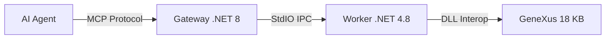

# GeneXus 18 MCP Server (Genexus18MCP)

A high-performance **Model Context Protocol (MCP)** server for GeneXus 18, enabling AI agents (like Claude, Cursor, Antigravity) to interact directly with your GeneXus Knowledge Base.

## 🌟 Key Features

- **Native Interop**: Runs on .NET Framework 4.8 to load GeneXus libraries (`Artech.Architecture.dll`) natively.
- **Structured Output**: All tools return optimized JSON for AI consumption (clean logs, diffs, metadata).
- **Dual Architecture**:
  - **Gateway (.NET 8)**: Handles MCP protocol and stdio communication.
  - **Worker (.NET 4.8)**: Performs the actual GeneXus operations in an isolated process.

## 🛠️ Installation & Setup

### Prerequisites

- Windows 10/11 or Server.
- **GeneXus 18** installed (Default: `C:\Program Files (x86)\GeneXus\GeneXus18`).
- **.NET 8 SDK** (for Gateway).
- **.NET Framework 4.8** (for Worker).

### 1. Build the Project

Run the included build script to compile and prepare the `publish/` directory:

```powershell
cd C:\Projetos\GenexusMCP
.\build.ps1
```

_Binaries will be placed in `C:\Projetos\GenexusMCP\publish`._

### 2. Configure `config.json`

Edit `C:\Projetos\GenexusMCP\publish\config.json`:

```json
{
  "GeneXus": {
    "InstallationPath": "C:\\Program Files (x86)\\GeneXus\\GeneXus18",
    "WorkerExecutable": "C:\\Projetos\\GenexusMCP\\src\\GxMcp.Worker\\bin\\Release\\GxMcp.Worker.exe"
    // ^ Ensure this points to the BUILT worker executable
  },
  "Environment": {
    "KBPath": "C:\\KBs\\YourKnowledgeBase"
  }
}
```

## 🤖 Antigravity / Cursor Configuration

Add this to your MCP configuration file (e.g., `mcp_config.json`):

```json
{
  "mcpServers": {
    "genexus": {
      "command": "dotnet",
      "args": [
        "run",
        "--project",
        "C:/Projetos/GenexusMCP/src/GxMcp.Gateway/GxMcp.Gateway.csproj"
      ]
    }
  }
}
```

_Note: Depending on your environment, you may reference the compiled binary `src/GxMcp.Gateway/bin/Release/net8.0/GxMcp.Gateway.exe` directly instead of `dotnet run`._

## 🧰 Available Tools

See `GEMINI.md` for the complete reference manual for AI Agents.

- **Reader**: `genexus_list_objects`, `genexus_search`, `genexus_read_object`, `genexus_analyze`
- **Writer**: `genexus_create_object`, `genexus_write_object`, `genexus_refactor`, `genexus_batch`
- **DevOps**: `genexus_build`, `genexus_doctor`, `genexus_history`, `genexus_wiki`

## 🏗️ Architecture


