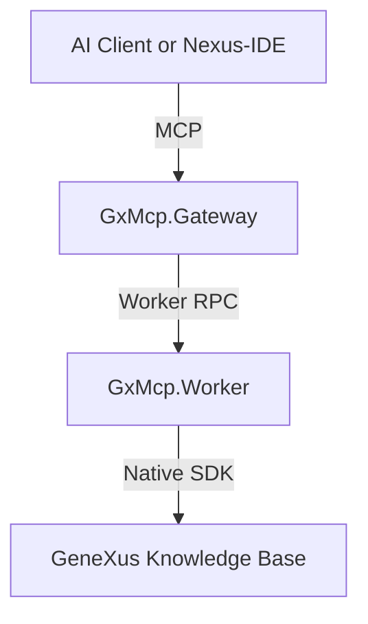

# GeneXus MCP Official Architecture Status

This file records the target architecture that is now in effect.

## Final architecture

- .NET 8 gateway for MCP protocol handling
- .NET Framework 4.8 worker for GeneXus SDK execution
- MCP over stdio and HTTP `/mcp`
- Nexus-IDE consuming MCP directly

## Protocol position

- `/mcp` is the official HTTP endpoint.
- `initialize`, `tools/list`, `resources/list`, `resources/templates/list`, `prompts/list`, `tools/call`, `resources/read`, and `prompts/get` are the expected workflow.
- HTTP sessions use `MCP-Protocol-Version: 2025-06-18` and `MCP-Session-Id`.

## Transport position

- The gateway surface is MCP-only.
- `/mcp` is the single HTTP contract.
- The extension and current docs treat the system as MCP-only in practice.

## Architecture consequences

- New features should be published as MCP tools, resources, prompts, or completion providers.
- The extension should continue consuming discovery rather than hidden request shapes.
- Gateway compatibility code can be removed once old external clients are retired.
